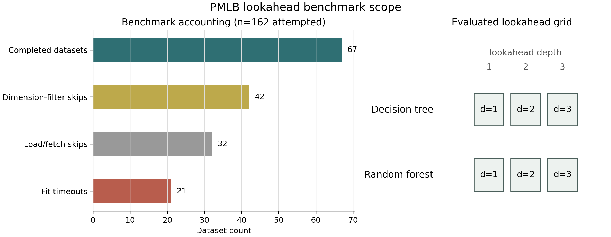
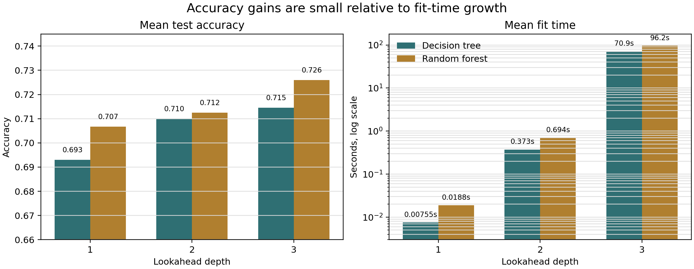

# One split at a time is usually enough: empirical limits of lookahead decision tree induction

## Abstract

We study whether multi-step split optimization materially improves decision
trees and forests over greedy CART-style induction, once predictive performance
and computational cost are evaluated jointly. Lookahead induction is
theoretically attractive: a split that is weak at the current node may enable
better descendant splits, so optimizing only one split at a time can be
suboptimal. We implemented lookahead split selection for decision trees and
forests and evaluated lookahead depths 1, 2, and 3 on 67 completed PMLB
classification datasets. Depth 1 corresponds to standard greedy induction. For
single trees, mean accuracy increased from 0.6931 at depth 1 to 0.7100 at depth
2 and 0.7145 at depth 3, while mean fit time increased from 0.008 s to 0.373 s
and 70.90 s. For forests, mean accuracy increased from 0.7068 to 0.7125 and
0.7260, while mean fit time increased from 0.019 s to 0.694 s and 96.19 s.
These results show that multi-step split optimization can improve predictive
performance, but in this benchmark the gains are thin, inconsistent, and very
expensive. Greedy induction remains surprisingly competitive when accuracy and
cost are evaluated together.

## 1. Introduction

Decision trees are usually induced one node at a time. In CART-style
algorithms, each internal node chooses the split that most improves a local
impurity criterion, without jointly optimizing the downstream subtree. This
greedy strategy is computationally convenient and remains central to single
trees and random forests, but it is not globally optimal. A locally attractive
split may lead to a poor subtree, and a locally unimpressive split may create
children that are easy to separate.

Lookahead induction directly addresses this myopia. Rather than scoring only
the immediate children of a candidate split, an n-sighted tree scores the best
subtree available over n generations. For a node containing samples S and
impurity I, a depth-n split may be viewed as maximizing the reduction

```text
I(S) - sum_{leaves L at depth n} |L| / |S| * I(L),
```

after optimizing the descendant splits below the candidate root split. The
usual greedy tree is the special case n = 1.

This observation gives a clear theoretical motivation for lookahead: there are
classification problems where a one-step split score is misleading, while a
two- or three-step objective can identify a better root split. The practical
question is different. Does this additional optimization materially improve
ordinary decision trees and forests once the computation required to search
over descendant splits is included?

This short paper answers that question empirically. We ask whether multi-step
split optimization materially improves decision trees and forests over greedy
CART-style induction, once predictive performance and computational cost are
evaluated jointly.

## 2. Methods

We compare lookahead depths 1, 2, and 3 for a single decision tree and for a
random forest whose individual trees use the same lookahead rule. All models use
axis-aligned splits. Depth 1 is the greedy baseline; depths 2 and 3 optimize the
split objective over one and two additional generations of descendants.

The benchmark uses PMLB classification datasets with a fixed experimental
protocol: stratified train-test split, test_size = 0.25, random_state = 0,
max_depth = 3, max_features = None, and no explicit max_split_candidates
restriction. Datasets with number of rows times number of predictors above
25000 were skipped after earlier timing experiments showed that larger problems
were impractical for depth-3 lookahead. Datasets that failed during loading or
fitting were skipped. If any model fit exceeded 30 minutes, the dataset was
excluded from the completed-dataset analysis.

The final completed benchmark contains 67 datasets and 402 model fits:



**Figure 1.** Benchmark scope for the PMLB lookahead experiments. The completed
analysis includes 67 datasets. Additional attempted datasets were skipped by the
dimension filter, by load or split failures, or by fit-time timeouts.

## 3. Results

Table 1 summarizes predictive accuracy and fit time. The first-order result is
simple: deeper lookahead improves mean accuracy, but the improvement is small
relative to the increase in fit time.

| Estimator | Lookahead | Mean accuracy | Median accuracy | Mean fit time (s) | Median fit time (s) |
|---|---:|---:|---:|---:|---:|
| Decision tree | 1 | 0.6931 | 0.7554 | 0.0076 | 0.0043 |
| Decision tree | 2 | 0.7100 | 0.7222 | 0.3727 | 0.0547 |
| Decision tree | 3 | 0.7145 | 0.7333 | 70.9025 | 2.1834 |
| Random forest | 1 | 0.7068 | 0.7500 | 0.0188 | 0.0116 |
| Random forest | 2 | 0.7125 | 0.7407 | 0.6940 | 0.1208 |
| Random forest | 3 | 0.7260 | 0.7612 | 96.1864 | 4.0572 |

**Table 1.** Aggregate performance over the 67 completed PMLB classification
datasets.



**Figure 2.** Mean test accuracy and mean fit time for lookahead depths 1, 2,
and 3. Fit time is shown on a log scale.

For single trees, moving from greedy depth 1 to lookahead depth 2 improves mean
accuracy by 1.69 percentage points, while the mean fit time is about 49 times
larger. Moving from depth 1 to depth 3 improves mean accuracy by 2.15
percentage points, while the mean fit time is about 9388 times larger.

For forests, depth 2 improves mean accuracy by 0.57 percentage points over
depth 1, with about 37 times larger mean fit time. Depth 3 improves mean
accuracy by 1.92 percentage points over depth 1, with about 5113 times larger
mean fit time.

The gains are also not consistent enough to make depth 3 an obvious default.
Counting ties as wins, depth 1 was tied for the best tree accuracy on 30
datasets, depth 2 on 31 datasets, and depth 3 on 37 datasets. For forests, the
corresponding counts were 36, 29, and 29. Thus, deeper lookahead can help, but
greedy induction remains competitive across many datasets.

## 4. Discussion

These experiments support a restrained conclusion. Multi-step split
optimization can improve decision trees and forests, and the theoretical
motivation is real. Greedy induction is myopic, and lookahead can recover splits
that a one-step impurity criterion undervalues. However, under this benchmark,
the empirical advantage is usually modest and comes with a large computational
cost.

This matters because speed is part of the appeal of decision trees and forests.
They are valued not only for interpretability and predictive performance, but
also for fast fitting, simple tuning, and robustness across many tabular
problems. A method that improves accuracy by one or two percentage points while
increasing fit time by orders of magnitude must be justified by a specific
problem need. As a routine replacement for greedy induction, depth-2 and
depth-3 lookahead do not clearly clear that bar.

The forest result is particularly instructive. Random forests already reduce
some instability of greedy trees by aggregating many fitted trees. In these
experiments, lookahead still improves the average forest accuracy at depth 3,
but the computational price remains severe. This suggests that ensembling does
not make deep lookahead free; it multiplies the search cost across trees.

## 5. Limitations

The analysis is intentionally narrow. It evaluates a single implementation, a
fixed train-test split, shallow trees with max_depth = 3, classification
datasets from PMLB, and lookahead depths no larger than 3. Different pruning
rules, candidate-split restrictions, caching strategies, parallelization,
hardware, or hyperparameters may change the tradeoff.

The completed-dataset averages should also be interpreted with the skip
accounting in mind. The benchmark excluded 42 datasets by the dimension filter,
32 datasets because of load or split failures, and 21 datasets because at least
one fit timed out. These exclusions do not invalidate the completed results, but
they do emphasize the practical fragility of deeper lookahead.

Finally, the present benchmark reports aggregate performance. A journal-length
version should preserve and analyze the per-dataset effects, including wins,
losses, uncertainty intervals, memory use, and sensitivity to forest size and
tree depth.

## 6. Conclusion

Lookahead split optimization is a principled correction to the local myopia of
greedy decision-tree induction. In the PMLB benchmark studied here, it does
improve mean accuracy for both trees and forests. The improvement, however, is
thin and not consistent, while the computational cost is huge. For routine
tabular modeling with shallow trees, one split at a time is usually enough.
Deeper lookahead appears better suited to targeted settings where computation is
cheap, tree depth is small, and the expected gain is problem-specific.

## References

Breiman, L. (2001). Random forests. Machine Learning, 45, 5-32.

Breiman, L., Friedman, J. H., Olshen, R. A., and Stone, C. J. (1984).
Classification and Regression Trees. Wadsworth.

Bertsimas, D., and Dunn, J. (2017). Optimal classification trees. Machine
Learning, 106, 1039-1082.

Olson, R. S., La Cava, W., Orzechowski, P., Urbanowicz, R. J., and Moore, J. H.
(2017). PMLB: a large benchmark suite for machine learning evaluation and
comparison. BioData Mining, 10, 36.
